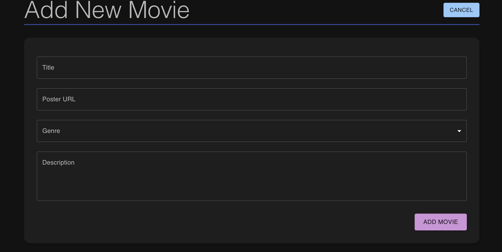

# Movie Manager

## Table of Contents

- [Overview](#overview)
- [Features](#features)
- [Screenshots](#screenshots)
- [Getting Started](#getting-started)
- [Installation](#installation)

---

## Overview

Movie Manager is a comprehensive movie management tool crafted with React, Redux, and Express. The application offers a user-friendly platform for movie enthusiasts to add, edit, and view their favorite movies, ensuring a personalized movie-manager experience.

## Features

- **Simplified Movie Addition**: Users can effortlessly add new movies, complete with title, genre, poster, and a detailed description.
- **Redux-Powered State Management**: The application leverages Redux to effectively handle and persist the state of movie data throughout the user's session.
- **Dynamic Movie Editing**: Users can easily modify movie details, ensuring their movie list remains up-to-date.
- **Interactive Movie Details View**: Each movie comes with a detailed view, allowing users to delve deeper into movie specifics.
- **RESTful API Interactions**: The app communicates with an Express backend to retrieve existing movies and save new entries.

## Screenshots




## Getting Started

### Prerequisites

- [Node.js](https://nodejs.org/en/)
- [Redux](https://redux.js.org/)

## Installation

1. **Clone the Repository**:
   ```bash
   git clone https://github.com/ssaid20/movies-react-sagas
   ```

2. Install the necessary dependencies:

   ```bash
   npm install
   ```

3. Start the Express server:

   ```bash
   npm run server
   ```

4. In a separate terminal instance, start the React client:
   ```bash
   npm run client
   ```